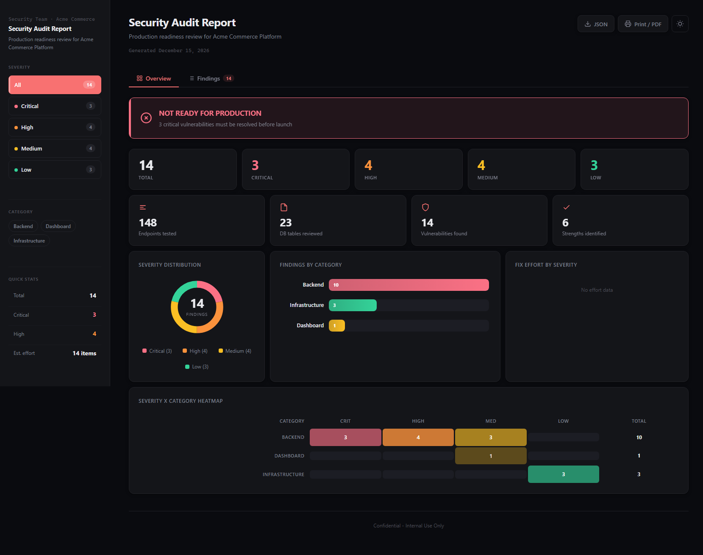
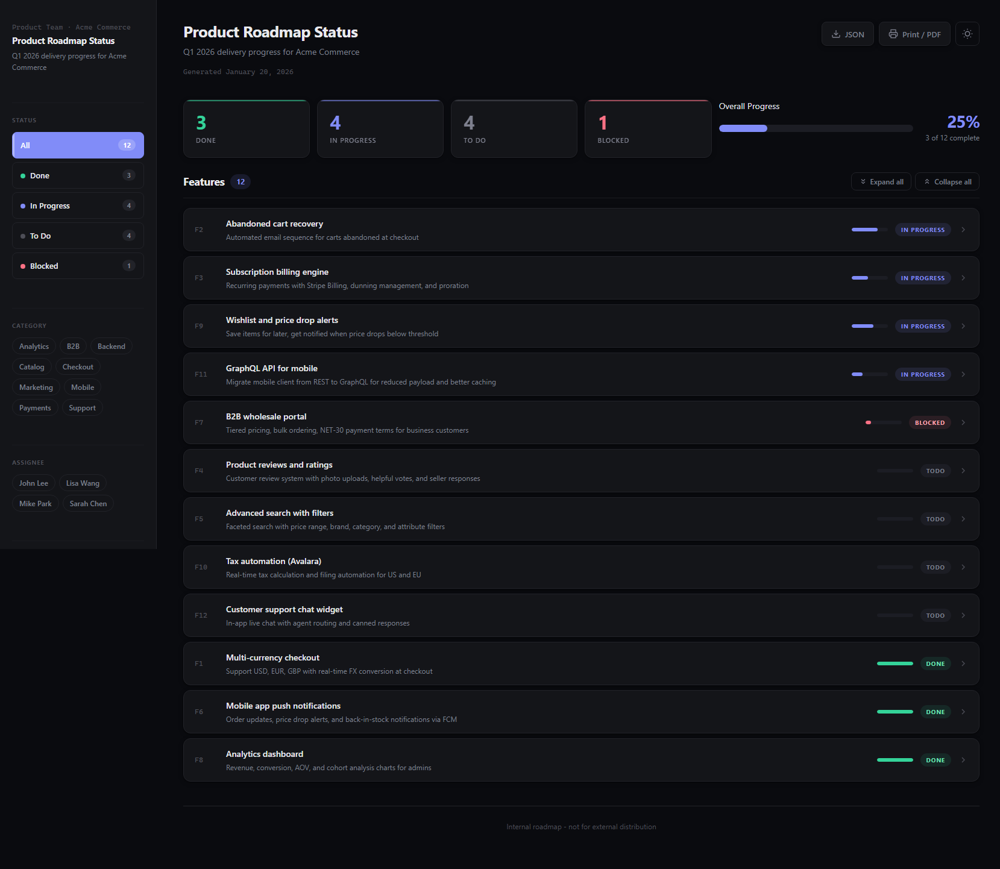
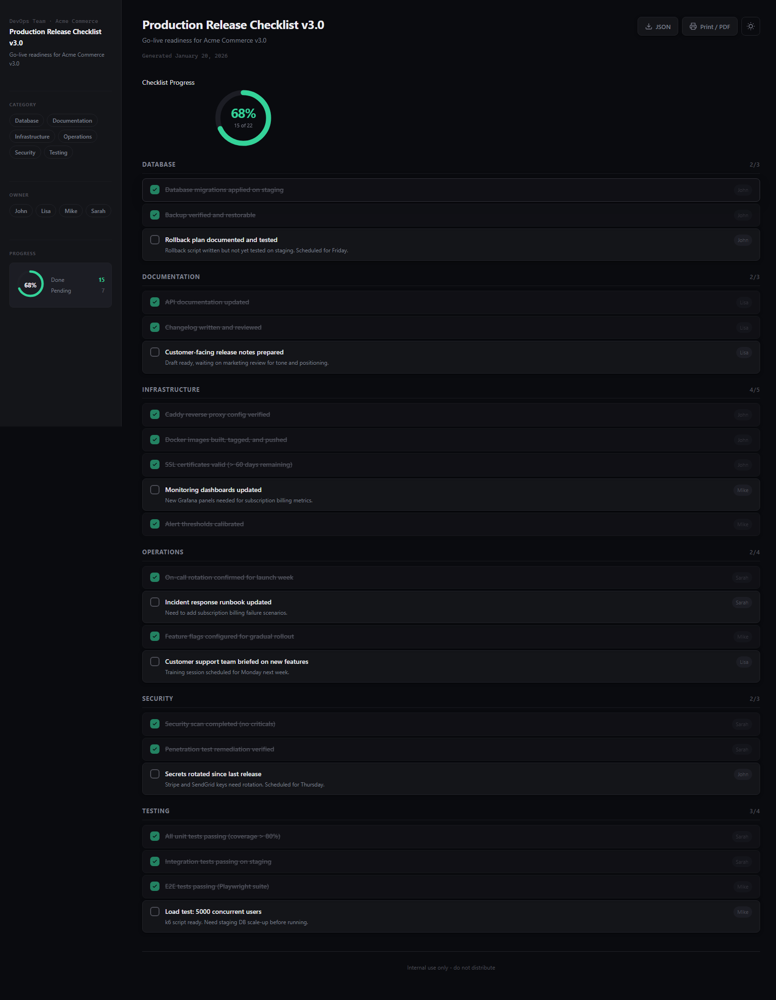
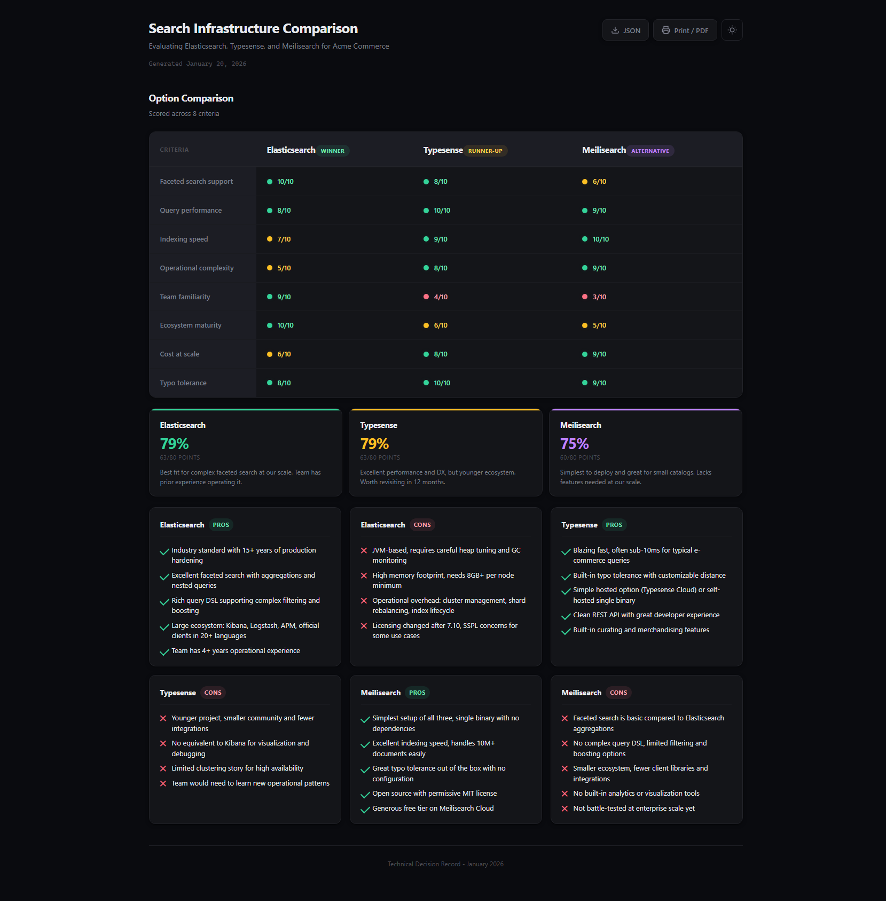

# Findings Visualizer

<p align="center"></p>

<p align="center">
  <a href="https://neang-mengseang.github.io/findings-visualizer/">Website</a> &middot;
  <a href="https://github.com/neang-mengseang/findings-visualizer/releases">Releases</a> &middot;
  <a href="https://github.com/neang-mengseang/findings-visualizer/blob/main/SKILL.md">Documentation</a> &middot;
  <a href="#install">Install</a>
</p>

<p align="center">
  <a href="https://github.com/neang-mengseang/findings-visualizer/releases"></a>
  
  
</p>

A Devin / Claude Code skill that turns any structured report into a self-contained, interactive HTML dashboard. Four report types supported: security audits, feature status trackers, release checklists, and tool comparisons.

## Screenshots

### Security Audit Report


### Feature Status Tracker


### Release Checklist


### Tool Comparison


## What it does

Instead of sharing findings as a wall of markdown text, this skill generates a single `.html` file you can open in any browser, share with stakeholders, or attach to a PR. No server, no dependencies, no build step.

**4 report types:**
- **Audit** - findings with severity levels (critical/high/medium/low). Security audits, code reviews, production readiness checks.
- **Status** - items with status (done/in-progress/todo/blocked). Feature trackers, sprint boards, project status.
- **Checklist** - items with a checked boolean. Release checklists, QA gates, deployment readiness.
- **Comparison** - options scored across criteria with pros/cons. Tool selection, architecture decisions, vendor comparison.

**Features:**
- Component-driven architecture: any component can mix with any data
- 7 optional templates for common report types (or use auto-detection)
- Adaptive sidebar with live filters (severity, status, category, assignee, owner)
- Mini progress ring and quick stats in the sidebar
- Light/dark theme toggle with circular reveal animation (always visible in header)
- 4 chart types: severity donut, category bars, effort breakdown, severity x category heatmap
- Status cards with clickable filtering
- Progress bar with live updates
- Circular checklist progress
- Comparison table with score dots, summary cards, and pros/cons
- Expandable feature rows with smooth animations and expand/collapse all controls
- Print/PDF export (Ctrl+P optimized stylesheet)
- JSON export (download raw data back from the page)
- Custom scrollbars matching the theme
- Sort, search, bulk expand/collapse, keyboard shortcuts
- 6 color presets (security, performance, architecture, code-quality, infra, default)
- 4 layout presets (default, compact, charts-first, list-first)
- Branding: author, company, logo, footer
- Optional sidebar (hide with `"sidebar": false`)
- 20 composable components
- Custom CSS escape hatch for full control
- Works offline, single file, zero external dependencies

## Install

### Option 1: skills.sh (recommended, all agents)

Works with Claude Code, Cursor, Cline, Windsurf, Gemini CLI, Devin, and 48+ other agent surfaces.

```bash
npx skills add neang-mengseang/findings-visualizer
```

That's it. The skill lands in your local skills directory and is ready to use. No clone, no build, no config.

Pin to a specific version:
```bash
npx skills add neang-mengseang/findings-visualizer@1.1.0
```

### Option 2: Install script (for manual / offline installs)

**Windows (PowerShell):**
```powershell
git clone https://github.com/neang-mengseang/findings-visualizer.git
cd findings-visualizer
.\scripts\install.ps1
```

**macOS / Linux (bash):**
```bash
git clone https://github.com/neang-mengseang/findings-visualizer.git
cd findings-visualizer
chmod +x scripts/install.sh
./scripts/install.sh
```

**Install options:**

| Flag | Description |
|------|-------------|
| `-Target "C:\path"` / `/custom/path` | Install to a custom directory |
| `-Force` / `--force` | Overwrite an existing install |
| `-ClaudeCode` / `--claude` | Install to `./.devin/skills/` in the current project (project-local) |

### Option 3: Claude Code plugin marketplace

```bash
/plugin marketplace add neang-mengseang/findings-visualizer
/plugin install findings-visualizer
```

### Option 4: Manual install

Copy the entire `findings-visualizer/` directory to your skills folder:

| Platform | Devin skills path |
|----------|-------------------|
| Windows | `C:\Users\<you>\AppData\Roaming\devin\skills\findings-visualizer\` |
| macOS | `~/.config/devin/skills/findings-visualizer/` |
| Linux | `~/.config/devin/skills/findings-visualizer/` |

For project-local skills, copy to `.devin/skills/findings-visualizer/` in your project root.

### Verify install

After installing, the skill directory should contain:
```
findings-visualizer/
├── SKILL.md
├── plugin.json
├── scripts/build.js
└── assets/
    ├── shell.html
    └── components/
        └── *.html (20 component files)
```

Restart your agent session to pick up the new skill.

## Usage

Just ask your AI agent:

> "Turn the audit findings into a visual report"
> "Generate an HTML dashboard from these findings"
> "Make this report look good"
> "Create a comparison table for these tools"
> "Track feature status visually"
> "Make a release checklist"

The AI will:
1. Identify the report type from your data (audit, status, checklist, or comparison)
2. Write a small config JSON + data JSON
3. Run `node scripts/build.js config.json -o report.html --open`
4. The build script assembles everything into one self-contained `.html` file
5. Edit the generated HTML directly for any custom tweaks

## Config JSON

### Minimal (just works)

```json
{
  "title": "Security Audit Report",
  "subtitle": "Q4 2026 penetration test",
  "findings": "findings.json"
}
```

For status/checklist, use `items` instead of `findings`. For comparison, use `comparison`.

### With presets + branding

```json
{
  "title": "Security Audit Report",
  "subtitle": "Q4 2026 penetration test",
  "findings": "findings.json",
  "preset": "security",
  "layout": "compact",
  "brand": { "author": "Jane Doe", "company": "Acme Inc", "footer": "Confidential" },
  "components": {
    "verdict": { "status": "fail", "title": "NOT READY", "subtitle": "3 critical vulnerabilities" },
    "stats": [{ "num": "50", "label": "Endpoints tested", "icon": "api" }]
  }
}
```

### Full customization

```json
{
  "title": "Architecture Review",
  "subtitle": "Module boundaries, type safety, data model",
  "findings": "findings.json",
  "preset": "architecture",
  "theme": {
    "dark": { "--accent": "#c084fc", "--bg": "#0a0b0f" },
    "light": { "--accent": "#7c3aed", "--bg": "#faf9f7" }
  },
  "layout": "charts-first",
  "sidebar": false,
  "brand": { "author": "John Smith", "company": "TechCorp", "footer": "Internal use only" },
  "customCss": ".verdict-banner { border-radius: 20px; }",
  "components": {
    "verdict": { "status": "warn", "title": "SOLID WITH CAVEATS", "subtitle": "1 high, 3 medium" },
    "stats": [{ "num": "332", "label": "Endpoints", "icon": "api" }],
    "order": ["verdict-banner", "summary-cards", "severity-chart", "findings-list"],
    "hide": ["heatmap-chart", "effort-chart"]
  }
}
```

See SKILL.md for the full config reference including all 4 data formats.

## Templates

Templates are optional shortcuts for common report types. They set a default preset and component layout. Any config field overrides the template.

| Template | Preset | Use for |
|----------|--------|---------|
| `security-audit` | security | Security audits, penetration test reports |
| `code-review` | code-quality | Code reviews, lint reports, tech debt |
| `feature-status` | default | Feature trackers, sprint status, roadmaps |
| `release-checklist` | code-quality | Release gates, QA checklists, deployment readiness |
| `comparison` | architecture | Tool comparison, vendor evaluation, architecture decisions |
| `performance-audit` | performance | Performance audits, load test reports |
| `architecture-review` | architecture | Architecture reviews, design audits |

```json
{
  "title": "Security Audit",
  "findings": "findings.json",
  "template": "security-audit",
  "components": {
    "verdict": { "status": "fail", "title": "NOT READY", "subtitle": "3 criticals" }
  }
}
```

Templates are optional. Without a template, the build script auto-detects which components to show based on what data you provide. You can also use `components.order` for full manual control. See SKILL.md for details.

## Color presets

| Preset | Accent | Use for |
|--------|--------|---------|
| `default` | Indigo | General purpose, feature tracking |
| `security` | Red | Security audits, vulnerability reports |
| `performance` | Cyan | Performance audits, load testing |
| `architecture` | Purple | Architecture reviews, comparison reports |
| `code-quality` | Emerald | Code quality, checklists, release gates |
| `infra` | Orange | Infrastructure, deployment, DevOps |

Each preset has tuned colors for both dark and light mode. Override any color with `theme: { dark: {...}, light: {...} }`.

## Layout presets

| Layout | Description |
|--------|-------------|
| `default` | Summary cards, stats, charts side by side, heatmap full width |
| `compact` | Tighter spacing, no heatmap, 3 equal-width charts |
| `charts-first` | Charts before summary cards |
| `list-first` | Minimal charts, findings list is the focus |

## Data formats

### Audit findings (severity-based)

```json
[
  {
    "id": "C1",
    "title": "API keys hardcoded in Docker image",
    "severity": "critical",
    "category": "Backend",
    "location": "Dockerfile:24",
    "impact": "Anyone with image access can extract keys",
    "recommendation": "Use Docker secrets or runtime env injection",
    "effort": "2 hours",
    "tags": ["secrets", "docker"]
  }
]
```

### Status items (feature tracking)

```json
[
  {
    "id": "F1",
    "title": "Multi-currency checkout",
    "description": "Support USD, EUR, GBP with real-time FX",
    "status": "done",
    "assignee": "Sarah Chen",
    "progress": 100,
    "category": "Checkout",
    "tags": ["payments"]
  }
]
```

### Checklist items (release gates)

```json
[
  {
    "id": "C1",
    "title": "All unit tests passing",
    "checked": true,
    "category": "Testing",
    "owner": "Sarah"
  }
]
```

### Comparison data (tool evaluation)

```json
{
  "options": [
    { "name": "Elasticsearch", "verdict": "winner", "notes": "Best fit at our scale" }
  ],
  "criteria": [{ "name": "Performance" }, { "name": "Cost" }],
  "optionsData": [
    { "name": "Elasticsearch", "scores": { "Performance": 8, "Cost": 6 } }
  ],
  "prosCons": {
    "Elasticsearch": { "pros": ["Mature"], "cons": ["High memory"] }
  }
}
```

See `examples/` for complete working demos of each report type.

## Examples

The `examples/` folder contains 4 showcase reports you can open directly:

| File | Type | Description |
|------|------|-------------|
| `showcase-audit.html` | Audit | Security audit with 14 findings, verdict banner, charts |
| `showcase-status.html` | Status | Product roadmap with 12 features, status cards, progress |
| `showcase-checklist.html` | Checklist | Release checklist with 22 items, circular progress |
| `showcase-comparison.html` | Comparison | Search infrastructure comparison, 3 options, pros/cons |

Each has a matching `-config.json` file showing the full configuration.

## License

MIT - see [LICENSE](LICENSE)
